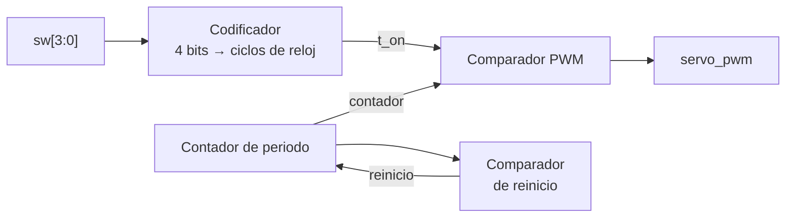

# Laboratorio 4 – Parte 1: Generación de PWM y Control de Servomotor

**Semana 1**

---

## Contenido

1. Objetivos de aprendizaje  
2. Fundamento teórico  
   2.1 Circuitos secuenciales  
   2.2 Contadores digitales  
   2.3 Contador como divisor de frecuencia  
   2.4 Modulación por ancho de pulso (PWM)  
   2.5 Arquitectura de un generador PWM  
   2.6 Servomotor  
   2.7 Señal de control PWM para servomotores  
3. Especificación del diseño  
4. Pre-informe  
5. Implementación y criterios de validación  

---

## 1. Objetivos de aprendizaje

- Comprender el funcionamiento de los circuitos secuenciales síncronos.
- Utilizar contadores como divisores de frecuencia y base de tiempo.
- Generar señales PWM utilizando contadores y comparadores.
- Controlar la posición de un servomotor desde una FPGA.
- Verificar el funcionamiento del sistema mediante simulación (Icarus Verilog y GTKWave).

---

## 2. Fundamento teórico

### 2.1 Circuitos secuenciales

Un circuito secuencial es un sistema digital cuya salida depende no solo de las entradas actuales, sino también del estado previo del sistema, el cual es almacenado en elementos de memoria como los flip-flops.

$$Salida = f(Entradas, Estado)$$

Los sistemas secuenciales síncronos actualizan su estado en función de una señal de reloj (clock), típicamente en el flanco de subida.

En Verilog, estos sistemas se describen mediante bloques `always` sensibles al reloj:

```verilog
always @(posedge clk)
begin
    // lógica secuencial
end
```

---

### 2.2 Contadores digitales

Un contador es un sistema secuencial que recorre una secuencia de estados de manera controlada por el reloj.

Para un contador de N bits:

$$\text{Número de estados} = 2^N$$

Ejemplo para 4 bits:

```
0000 → 0001 → 0010 → ... → 1111 → 0000
```

Un contador también puede reiniciarse al alcanzar un valor máximo distinto de $2^N - 1$. En ese caso se usa un **comparador de reinicio**: cuando el contador llega al valor máximo, en el siguiente flanco vuelve a cero. Así se obtiene un contador módulo M con cualquier valor de M.

---

### 2.3 Contador como divisor de frecuencia

En una FPGA, el tiempo se representa contando ciclos de reloj. Si el reloj tiene frecuencia $f_{clk}$, un intervalo de tiempo $t$ corresponde a:

$$N = t \cdot f_{clk}$$

Para generar un evento periódico de frecuencia $f_{tick}$ se usa un contador módulo N:

$$N = \frac{f_{clk}}{f_{tick}}$$

El número de bits necesario para el contador es:

$$bits = \lceil \log_2 N \rceil$$

Ejemplo (no corresponde a este laboratorio): para obtener un evento de 1 Hz a partir de un reloj de 10 MHz se necesita $N = 10\,000\,000$, es decir, un contador de 24 bits.

**Buena práctica:** la salida del divisor no debe usarse como un nuevo reloj. Lo recomendado es generar un **pulso de habilitación** (tick) de un ciclo de duración cada N ciclos, y que el resto del sistema siga usando el reloj principal:

```verilog
always @(posedge clk)
begin
    if (tick)
        contador <= contador + 1;   // avanza solo cuando tick = 1
end
```

De esta forma todo el sistema es completamente síncrono.

---

### 2.4 Modulación por ancho de pulso (PWM)

La modulación por ancho de pulso (PWM) es una técnica que permite controlar la potencia promedio entregada a una carga, o transmitir una referencia, utilizando una señal digital periódica.

$$Duty = \frac{T_{on}}{T_{periodo}}$$

Ejemplo conceptual:

```
25%  ███........
50%  █████.....
75%  ███████...
```

---

### 2.5 Arquitectura de un generador PWM

Un generador PWM digital se basa en tres bloques principales: una base de tiempo, un contador y un comparador.

<p align="center">
 
</p>
<p align="center">
 Figura 1: Esquema de un generador PWM
</p>

Principio de funcionamiento: mientras el contador sea menor que el valor de referencia, la salida está en alto.

```verilog
assign PWM = (contador < duty);
```

Si el contador avanza a una frecuencia $f_{cont}$ (la del reloj, o la del tick si se usa una base de tiempo) y recorre sus $2^N$ estados, la frecuencia del PWM es:

$$f_{PWM} = \frac{f_{cont}}{2^N}$$

Si el contador se reinicia al llegar a un valor máximo M (contador módulo M):

$$f_{PWM} = \frac{f_{cont}}{M}$$

---

### 2.6 Servomotor

Un **servomotor** es un sistema electromecánico diseñado para controlar de manera precisa la **posición angular** de un eje. A diferencia de un motor DC convencional, el servomotor no se controla directamente por voltaje o corriente, sino mediante una **señal de control PWM** que indica la posición deseada.

Internamente, un servomotor está compuesto por:

- Un **motor DC**
- Un **sistema de engranajes** (reducción mecánica)
- Un **sensor de posición** (típicamente un potenciómetro)
- Un **circuito de control interno**

Este circuito interno se encarga de:

- Comparar la posición actual con la posición deseada  
- Ajustar automáticamente la corriente del motor  
- Mantener la posición alcanzada  

Por esta razón, el servomotor es un sistema **en lazo cerrado**, donde el usuario únicamente define la referencia mediante una señal PWM.

<p align="center">
 
</p>
<p align="center">
 Figura 2: Estructura interna del servomotor
</p>

#### Conexión de un servomotor

Un servomotor típico tiene tres cables:

| Cable | Función |
|------|--------|
| Rojo | Alimentación |
| Negro / Marrón | Tierra (GND) |
| Amarillo / Naranja | Señal PWM |

La señal PWM es únicamente una **señal de control**, por lo que:

- No transporta potencia significativa  
- No requiere un driver de potencia (como L293D o L298N)  
- Solo transmite la referencia de posición al sistema interno del servo  

<p align="center">
 
</p>
<p align="center">
 Figura 3: Esquema de pines del servo
</p>

#### Conexión básica

```
FPGA PWM --------> Señal servo
GND FPGA --------> GND servo
Fuente 5V -------> Vcc servo
```

- La FPGA genera únicamente la señal PWM.  
- El servomotor debe alimentarse con una fuente externa.  

Condición obligatoria:

```
GND FPGA = GND fuente externa
```

---

### 2.7 Señal de control PWM para servomotores

Los servomotores se controlan mediante una señal PWM periódica.

Parámetros principales:

- Periodo (T): 20 ms  
- Ancho del pulso (T_on): 1 ms a 2 ms  
- Duty cycle  

$$Duty = \frac{T_{on}}{T}$$

Valores típicos:

| Posición | Pulso |
|----------|--------|
| 0°       | 1 ms   |
| 90°      | 1.5 ms |
| 180°     | 2 ms   |

Se debe respetar el periodo de 20 ms antes de enviar un nuevo valor.

Ejemplo (90°):

```
█████████........................
|--1.5ms-|
|------------20ms----------------|
```

**Nota:** muchos servos comerciales (por ejemplo, SG90 o MG90) no recorren exactamente 180° con pulsos de 1 a 2 ms. Si durante la implementación el recorrido no coincide con lo esperado, se debe calibrar y documentar el ajuste.

---

## 3. Especificación del diseño

### 3.1 Arquitectura

El generador debe implementarse como un **sistema secuencial síncrono**, en el cual el tiempo es representado mediante conteo de ciclos de reloj.



#### Contador de periodo

Contador binario de tamaño suficiente para representar el periodo completo de la señal PWM. Se incrementa en cada flanco de subida del reloj (o en cada tick de una base de tiempo) y se reinicia al alcanzar el valor máximo correspondiente al periodo.

#### Comparador de reinicio (control de periodo)

Compara el valor actual del contador con el valor máximo del periodo y genera la condición de reinicio. Garantiza que la señal PWM sea **periódica y estable en el tiempo**.

#### Entrada de usuario (resolución de 4 bits)

El ancho del pulso se define mediante una entrada digital de **4 bits**, que representa un valor discreto dentro del rango de operación del servomotor.

#### Codificador (mapeo de entrada a tiempo)

Recibe el valor de 4 bits y genera un valor de referencia en ciclos de reloj, que representa el tiempo en alto del pulso. El grupo debe definir la relación entre el valor de entrada y el tiempo correspondiente, garantizando que se cubra el rango de operación del servomotor.

#### Comparador de PWM (generación de la señal)

Compara el valor del contador con el valor generado por el codificador:

- Si el contador es menor al valor de referencia → la señal PWM está en alto  
- En caso contrario → la señal PWM está en bajo  

### 3.2 Interfaz del sistema

Entradas:
- `clk`
- `rst`
- `sw[3:0]`: posición del servo

Salida:
- `servo_pwm`

El generador debe describirse como un **módulo independiente** con una entrada de posición `pos[3:0]`, porque en la Parte 3 la máquina de estados lo reutiliza: `pos = 0` para la puerta cerrada y `pos = 15` para la puerta abierta.

### 3.3 Requisitos

1. El sistema debe ser **completamente síncrono**, con un solo reloj. Si se usa un divisor de frecuencia, debe generar un pulso de habilitación, no un reloj nuevo.
2. El módulo debe tener un parámetro `CLK_FREQ` con la frecuencia del reloj, de modo que el testbench pueda usar un valor reducido y la simulación sea rápida.
3. `pos = 0` debe corresponder a la posición mínima (1 ms) y `pos = 15` a la posición máxima (2 ms).
4. El servomotor debe alimentarse con una **fuente externa de 5 V**, con GND común a la FPGA.

**Consideraciones de diseño:** el correcto funcionamiento depende de la adecuada selección del tamaño del contador, la correcta definición de los valores de comparación y la coherencia entre el periodo total y el ancho del pulso. Si el grupo encuentra una forma de diseño más sencilla, sin usar un bloque especial de Verilog, es bienvenida y debe justificarse.

---

## 4. Pre-informe

- **Diseño del sistema:**
  - Diagrama de bloques propio, con nombres y anchos de todas las señales.
  - Tabla de cálculos completada:

    | Parámetro | Tiempo | Cuentas de reloj | Bits del contador |
    |---|---|---|---|
    | Reloj de la tarjeta (`CLK_FREQ`) | | — | — |
    | Periodo del PWM | 20 ms | | |
    | T_on mínimo (`pos = 0`) | 1 ms | | |
    | T_on máximo (`pos = 15`) | 2 ms | | |
    | Paso del codificador (por unidad de `pos`) | | | |

  - Relación entre la entrada de 4 bits y el tiempo en alto, justificada.
- **Descripción en HDL:** código del generador PWM y del módulo top de esta parte, explicando cómo se implementa cada bloque de la arquitectura.
- **Simulación:** testbench que verifique el periodo de 20 ms y el ancho del pulso para `pos = 0`, un valor intermedio y `pos = 15`. Capturas de GTKWave con las mediciones, comparadas con la tabla de cálculos.

---

## 5. Implementación y criterios de validación

**Implementación (informe):** asignación de pines, esquema de conexión del servo con la fuente externa, observaciones de la prueba en hardware (incluida la calibración del servo, si fue necesaria) y evidencia en foto o video.

**Criterios de validación:**

- En simulación, el periodo de la señal es de 20 ms.
- En simulación, el ancho del pulso corresponde a lo calculado para `pos = 0`, un valor intermedio y `pos = 15`.
- En hardware, el servo se mueve a 16 posiciones distintas y estables según `sw[3:0]`.
