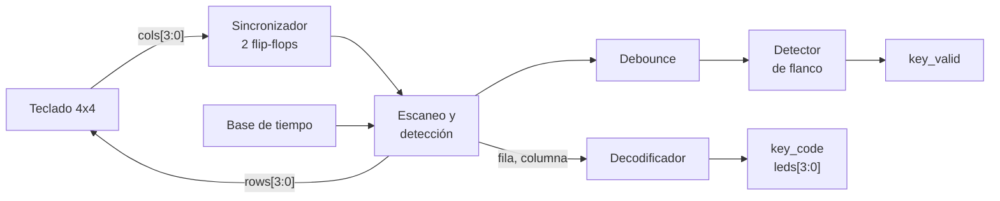

# Laboratorio 4 – Parte 2: Interfaz con Teclado Matricial

**Semana 2**

---

## Contenido

1. Objetivos de aprendizaje  
2. Fundamento teórico  
   2.1 Teclado matricial  
   2.2 Escaneo  
   2.3 Detección  
   2.4 Sincronización de señales externas  
   2.5 Rebote y debounce  
   2.6 Pulso de tecla válida  
3. Especificación del diseño  
4. Pre-informe  
5. Implementación y criterios de validación  
6. Material de apoyo: modelo del teclado para testbench  

---

## 1. Objetivos de aprendizaje

Al finalizar esta parte del laboratorio, el estudiante será capaz de:

- Comprender el funcionamiento de un teclado matricial.
- Implementar el escaneo de filas y la lectura de columnas.
- Diseñar un sistema de detección de teclas.
- Sincronizar señales externas.
- Implementar técnicas de debounce.

---

## 2. Fundamento teórico

### 2.1 Teclado matricial

Un teclado matricial organiza las teclas en filas y columnas, reduciendo el número de pines necesarios. Un teclado de 4×4 tiene 16 teclas y solo necesita 8 pines.

<p align="center">
 
</p>
<p align="center">
 Figura 1: Estructura interna del teclado matricial
</p>

### 2.2 Escaneo

El sistema activa una fila a la vez y lee las columnas para detectar una tecla. En este laboratorio el escaneo es **activo en bajo**:

- La fila activa se pone en 0.
- Las columnas tienen resistencias de pull-up, por lo que leen 1 cuando no hay tecla presionada.
- Si se presiona una tecla de la fila activa, su columna lee 0.
- Las filas inactivas se dejan en **alta impedancia** (`1'bz`). Si se pusieran en 1, presionar dos teclas de la misma columna conectaría una salida en 0 con una salida en 1 (cortocircuito).

El escaneo debe avanzar con una base de tiempo (por ejemplo, una fila por milisegundo), no en cada ciclo de reloj. Las columnas se leen antes de pasar a la siguiente fila: el sincronizador de la sección 2.4 las retrasa dos ciclos de reloj, y si se leen justo después de cambiar de fila corresponden todavía a la fila anterior.

### 2.3 Detección

Una tecla se identifica mediante la combinación fila-columna.

<p align="center">
 
</p>
<p align="center">
 Figura 2: Escaneo del teclado matricial
</p>

### 2.4 Sincronización de señales externas

Las columnas del teclado son señales externas que cambian en cualquier momento, sin relación con el reloj de la FPGA. Si una señal cambia justo en el flanco de reloj, el flip-flop que la captura puede quedar en un estado intermedio durante un tiempo (**metaestabilidad**).

Para reducir este riesgo, toda señal externa debe pasar por un **sincronizador de dos flip-flops** antes de usarse:

```verilog
reg [3:0] cols_s1, cols_s2;

always @(posedge clk)
begin
    cols_s1 <= cols;
    cols_s2 <= cols_s1;   // usar cols_s2 en el resto del diseño
end
```

### 2.5 Rebote y debounce

Los botones mecánicos no generan transiciones limpias al ser presionados, sino que producen múltiples cambios rápidos de estado debido al rebote de sus contactos internos. Este fenómeno ocurre típicamente en un intervalo de entre 5 ms y 20 ms.

Por esta razón, es necesario implementar un mecanismo de validación temporal (debounce) que garantice que la señal permanezca estable durante un tiempo mayor al rebote (por ejemplo, 10 ms) antes de considerarla como una pulsación válida.

Durante el escaneo, las columnas solo muestran una tecla mientras su fila está activa, por lo que el debounce no puede aplicarse directamente a `cols`. Debe aplicarse a la tecla detectada. Una forma sencilla es detener el escaneo mientras haya una tecla presionada y validar que la misma columna permanezca en 0 durante el tiempo de debounce.

### 2.6 Pulso de tecla válida

Una vez validada la tecla, el sistema debe generar una señal `key_valid` que dure **un solo ciclo de reloj** por cada pulsación. Si `key_valid` permanece en alto mientras la tecla está presionada, el sistema que la recibe interpretará miles de pulsaciones. Para obtener un pulso de un ciclo se usa un **detector de flanco**:

```verilog
reg presionada_ant;

always @(posedge clk)
    presionada_ant <= presionada_estable;

assign key_valid = presionada_estable & ~presionada_ant;
```

Una nueva pulsación solo debe aceptarse después de que la tecla se haya soltado.

---

## 3. Especificación del diseño

### 3.1 Diagrama de bloques



### 3.2 Interfaz del sistema

Entradas:
- `clk`
- `rst`
- `cols[3:0]`

Salidas:
- `rows[3:0]`
- `leds[3:0]`: código de la última tecla presionada
- `key_valid`

El módulo del teclado debe entregar `key_code[3:0]` y `key_valid`, que se reutilizan en la Parte 3. En esta parte, `key_code` se muestra en `leds[3:0]`.

### 3.3 Mapeo del teclado

Distribución de las teclas (verificar con el teclado físico, ya que el orden de los pines puede variar entre fabricantes):

|        | Col 0 | Col 1 | Col 2 | Col 3 |
|--------|:-----:|:-----:|:-----:|:-----:|
| **Fila 0** | 1 | 2 | 3 | A |
| **Fila 1** | 4 | 5 | 6 | B |
| **Fila 2** | 7 | 8 | 9 | C |
| **Fila 3** | * | 0 | # | D |

Código de 4 bits (`key_code`) que debe generar cada tecla:

| Tecla | Código |
|---|---|
| 0 – 9 | 0 – 9 (su propio valor) |
| A, B, C, D | 10, 11, 12, 13 |
| * | 14 |
| # | 15 |

El código debe ser el **valor de la tecla**, no su posición en la matriz. Por ejemplo, la tecla `0` (fila 3, columna 1) debe generar `key_code = 0`.

### 3.4 Requisitos

1. Las columnas deben pasar por un **sincronizador de dos flip-flops**.
2. El debounce debe validar la tecla durante al menos **10 ms**.
3. `key_valid` debe durar **un ciclo de reloj** por pulsación, y una nueva pulsación solo se acepta tras soltar la tecla.
4. Las filas inactivas deben quedar en **alta impedancia** y las columnas deben tener **pull-up** (interno de la FPGA o resistencias externas).
5. Los códigos de tecla deben seguir la tabla de la sección 3.3.
6. El módulo debe tener un parámetro `CLK_FREQ`, igual que en la Parte 1.

---

## 4. Pre-informe

- **Diseño del sistema:**
  - Diagrama de bloques propio de la interfaz, con nombres y anchos de todas las señales. Si la interfaz se diseña como máquina de estados, incluir su diagrama de estados.
  - Tabla de cálculos completada:

    | Parámetro | Tiempo | Cuentas de reloj | Bits del contador |
    |---|---|---|---|
    | Base de tiempo del escaneo (tiempo por fila) | | | |
    | Tiempo de debounce | ≥ 10 ms | | |

- **Descripción en HDL:** código del módulo del teclado y del módulo top de esta parte, explicando el sincronizador, el escaneo, el debounce y el detector de flanco.
- **Simulación:** testbench con el modelo del teclado de la sección 6, incluyendo rebote. Debe verificar los 16 códigos y que cada pulsación genere un único pulso de `key_valid`.

---

## 5. Implementación y criterios de validación

**Implementación (informe):** asignación de pines (incluida la configuración de pull-ups), esquema de conexión del teclado, observaciones de la prueba en hardware y evidencia en foto o video.

**Criterios de validación:**

- Cada tecla produce un código único entre 0 y 15, según la tabla de la sección 3.3.
- Cada pulsación genera un único pulso de `key_valid`, incluso con rebote simulado.
- En hardware, no hay rebotes ni repeticiones visibles en los LEDs.

---

## 6. Material de apoyo: modelo del teclado para testbench

Este modelo reproduce el comportamiento eléctrico del teclado: cuando la tecla de la fila `f` y la columna `c` está presionada y esa fila está activa (en 0), la columna correspondiente lee 0. Las demás columnas leen 1, como si tuvieran pull-up.

```verilog
reg        presionada = 1'b0;
reg  [1:0] f, c;                 // fila y columna de la tecla presionada
wire [3:0] rows;                 // salida del DUT
wire [3:0] cols = (presionada && rows[f] === 1'b0) ? ~(4'b0001 << c) : 4'b1111;

// Simula una pulsación con rebote.
// T_REBOTE, T_PRESION y T_SOLTAR son retardos definidos en el testbench.
task presionar(input [1:0] fila, input [1:0] col);
    integer i;
    begin
        f = fila;
        c = col;
        for (i = 0; i < 5; i = i + 1) begin   // rebote al presionar
            presionada = 1'b1; #(T_REBOTE);
            presionada = 1'b0; #(T_REBOTE);
        end
        presionada = 1'b1; #(T_PRESION);      // tecla sostenida
        presionada = 1'b0; #(T_SOLTAR);       // tecla suelta
    end
endtask
```

Ejemplo de uso para ingresar la secuencia 1-2-3-4:

```verilog
presionar(2'd0, 2'd0);   // tecla 1
presionar(2'd0, 2'd1);   // tecla 2
presionar(2'd0, 2'd2);   // tecla 3
presionar(2'd1, 2'd0);   // tecla 4
```

`T_PRESION` y `T_SOLTAR` deben ser mayores que el tiempo de debounce. Se recomienda usar un valor reducido de `CLK_FREQ` en el testbench para que la simulación sea rápida.
