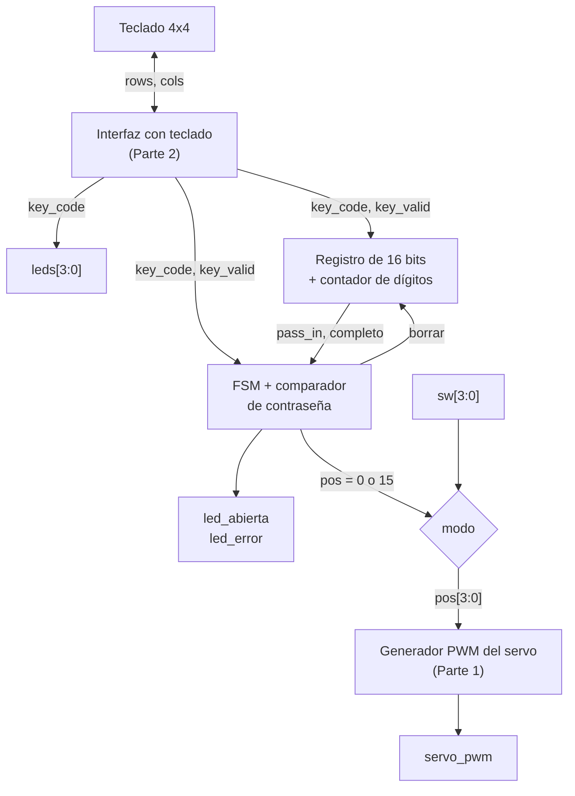
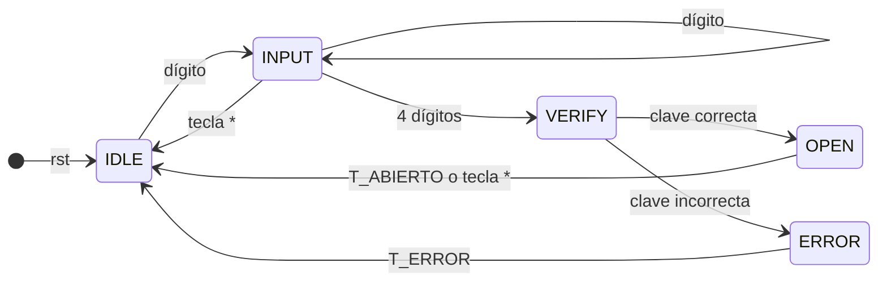

# Laboratorio 4 – Parte 3: Registro de Desplazamiento, FSM y Cerradura Electrónica

**Semana 3**

---

## Contenido

1. Objetivos de aprendizaje  
2. Fundamento teórico  
   2.1 Registro de desplazamiento por dígitos  
   2.2 Validación de contraseña  
   2.3 Máquinas de estados finitos (FSM)  
   2.4 PWM para el servo  
3. Especificación del sistema  
4. Pre-informe  
5. Implementación y criterios de validación  
6. Resultados y análisis  

---

## 1. Objetivos de aprendizaje

Al finalizar esta parte del laboratorio, el estudiante será capaz de:

- Implementar registros de desplazamiento para almacenamiento de datos.
- Diseñar un sistema de validación de contraseña.
- Desarrollar una FSM para control del sistema.
- Controlar un servo mediante PWM, reutilizando el generador de la Parte 1.
- Integrar un sistema completo entrada → procesamiento → acción.

---

## 2. Fundamento teórico

### 2.1 Registro de desplazamiento por dígitos

Se implementa un registro de 16 bits que almacena 4 dígitos BCD.

Cada nuevo dígito desplaza el contenido 4 bits a la izquierda:

```verilog
pass_in[15:12] <= pass_in[11:8];
pass_in[11:8]  <= pass_in[7:4];
pass_in[7:4]   <= pass_in[3:0];
pass_in[3:0]   <= key_code;
```

Ejemplo:

Entrada: 1 → 2 → 3 → 4  
Resultado: `0001 0010 0011 0100`

Junto al registro se necesita un **contador de dígitos** que indique cuándo se han ingresado los 4 dígitos.

### 2.2 Validación de contraseña

Se compara la entrada con una clave fija. La comparación puede hacerse bit a bit (compuertas XNOR y AND), mediante un restador digital o con el operador de igualdad de Verilog. La elección del circuito queda a decisión del grupo y debe justificarse.

### 2.3 Máquinas de estados finitos (FSM)

Una máquina de estados finitos es un sistema secuencial que se encuentra en uno de un número finito de estados y cambia de estado según sus entradas. En una **máquina de Moore**, las salidas dependen únicamente del estado actual.

Una FSM en Verilog se describe en tres partes:

1. **Registro de estado:** almacena el estado actual y se actualiza en el flanco de reloj.
2. **Lógica de siguiente estado:** circuito combinacional que decide el próximo estado según el estado actual y las entradas.
3. **Lógica de salida:** circuito combinacional que genera las salidas según el estado.

Ejemplo con tres estados:

```verilog
localparam S0 = 2'd0, S1 = 2'd1, S2 = 2'd2;

reg [1:0] estado, siguiente;

// 1. Registro de estado
always @(posedge clk)
    if (rst) estado <= S0;
    else     estado <= siguiente;

// 2. Lógica de siguiente estado
always @(*)
begin
    siguiente = estado;           // por defecto, permanece en el mismo estado
    case (estado)
        S0: if (entrada)  siguiente = S1;
        S1: if (!entrada) siguiente = S2;
        S2: siguiente = S0;
        default: siguiente = S0;
    endcase
end

// 3. Lógica de salida
assign salida = (estado == S2);
```

### 2.4 PWM para el servo

- Periodo: 20 ms  
- 1 ms → cerrado (`pos = 0` en el generador de la Parte 1)  
- 2 ms → abierto (`pos = 15` en el generador de la Parte 1)  

---

## 3. Especificación del sistema

### 3.1 Descripción general

El sistema debe:

1. Recibir datos del teclado (Parte 2).
2. Almacenar 4 dígitos.
3. Validar la contraseña.
4. Activar el servo (Parte 1) e indicar el estado con LEDs.

El sistema tiene dos modos de operación, seleccionados con la entrada `modo`:

| `modo` | Funcionamiento |
|---|---|
| 0 | **Manual:** la posición del servo se define con `sw[3:0]`, como en la Parte 1 |
| 1 | **Cerradura:** la posición del servo la define la FSM |

### 3.2 Diagrama de bloques



### 3.3 Interfaz del sistema

```verilog
module cerradura_top #(
    parameter        CLK_FREQ = 50_000_000,  // Hz, ajustar al oscilador de la tarjeta
    parameter [15:0] PASSWORD = 16'h1234     // clave en BCD
)(
    input  wire       clk,
    input  wire       rst,
    input  wire       modo,         // 0: servo manual, 1: cerradura
    input  wire [3:0] sw,           // posición manual del servo
    input  wire [3:0] cols,         // columnas del teclado (con pull-up)
    output wire [3:0] rows,         // filas del teclado (inactivas en alta impedancia)
    output wire [3:0] leds,         // código de la última tecla
    output wire       led_abierta,
    output wire       led_error,
    output wire       servo_pwm
);

    // Instanciar aquí los módulos del sistema

endmodule
```

Las entradas y salidas de la tarjeta pueden ser activas en bajo; en ese caso, la inversión debe hacerse en el módulo top.

### 3.4 Máquina de estados de la cerradura



| Estado | Servo (`pos`) | `led_abierta` | `led_error` | Descripción |
|---|---|---|---|---|
| IDLE | 0 (cerrado) | 0 | 0 | Puerta cerrada; registro y contador de dígitos en cero. Con el primer dígito pasa a INPUT y lo almacena |
| INPUT | 0 (cerrado) | 0 | 0 | Almacena cada dígito en el registro. Con el cuarto dígito pasa a VERIFY; con `*` vuelve a IDLE |
| VERIFY | 0 (cerrado) | 0 | 0 | Compara `pass_in` con `PASSWORD` durante un ciclo |
| OPEN | 15 (abierto) | 1 | 0 | Puerta abierta durante `T_ABIERTO`, o hasta presionar `*`; luego vuelve a IDLE (cierre) |
| ERROR | 0 (cerrado) | 0 | 1 | Indica error durante `T_ERROR` y vuelve a IDLE |

Valores de referencia: `T_ABIERTO = 5 s`, `T_ERROR = 2 s`. Las teclas sin función (A, B, C, D y #) se ignoran.

### 3.5 Requisitos

1. Se deben reutilizar el generador PWM de la Parte 1 y la interfaz con teclado de la Parte 2.
2. Solo los dígitos 0–9 se almacenan en el registro.
3. La clave debe definirse como parámetro de 16 bits en BCD, por ejemplo `parameter [15:0] PASSWORD = 16'h1234;` (en hexadecimal cada dígito ocupa 4 bits, por lo que coincide con el BCD de 1-2-3-4).
4. Los temporizadores deben usar la base de tiempo y depender de `CLK_FREQ`.

### 3.6 Módulos sugeridos

La siguiente división es una sugerencia; el grupo puede proponer otra justificándola.

| Módulo | Función |
|---|---|
| `servo_pwm` | Generador PWM de la Parte 1 |
| `teclado` | Interfaz con teclado de la Parte 2 |
| `registro_pass` | Registro de desplazamiento de 16 bits y contador de dígitos |
| `fsm_cerradura` | Máquina de estados, comparación de contraseña y temporizadores |
| `cerradura_top` | Integración de todos los módulos y selección de modo |

---

## 4. Pre-informe

- **Diseño del sistema:**
  - Diagrama de bloques propio del sistema completo, con nombres y anchos de todas las señales.
  - Diagrama de estados de la cerradura y tabla de transiciones.
  - Tabla de cálculos completada:

    | Parámetro | Tiempo | Cuentas de la base de tiempo | Bits del contador |
    |---|---|---|---|
    | T_ABIERTO | 5 s | | |
    | T_ERROR | 2 s | | |

  - Justificación del método de comparación de contraseña elegido.
- **Descripción en HDL:** código del registro, de la FSM y del módulo top, explicando la lógica de siguiente estado y cómo se integran los módulos de las partes 1 y 2.
- **Simulación:** testbench del sistema completo con el modelo del teclado de la Parte 2. Debe verificar una clave correcta, una clave incorrecta y el uso de la tecla `*` en INPUT y en OPEN.

---

## 5. Implementación y criterios de validación

**Implementación (informe):** asignación de pines del sistema completo, esquema de conexión del teclado, el servo y la fuente externa, observaciones de la prueba en hardware y evidencia en foto o video.

**Criterios de validación:**

- Con la clave correcta, el servo abre la puerta, se enciende `led_abierta` y la puerta se cierra sola al cumplirse `T_ABIERTO`.
- Con una clave incorrecta, se enciende `led_error` durante `T_ERROR` y el sistema vuelve a IDLE.
- La tecla `*` borra la clave en INPUT y cierra la puerta en OPEN.
- En modo manual, el servo responde a `sw[3:0]` como en la Parte 1.

---

## 6. Resultados y análisis

- Comparación entre lo diseñado, lo simulado y lo implementado en las tres partes.
- Problemas encontrados y cómo se resolvieron.
- Código HDL e imágenes de simulación en el `README.md` del repositorio, que debe incluir:
  - Descripción breve del sistema y de cada módulo.
  - Comandos para simular, por ejemplo:

    ```
    iverilog -o sim.vvp testbench/tb_cerradura.v src/*.v
    vvp sim.vvp
    gtkwave cerradura.vcd
    ```

  - Imágenes de simulación de cada módulo y del sistema completo.
  - Enlace al video de la demostración.

Estructura sugerida del repositorio:

```
Lab_4/
├── src/          # módulos Verilog
├── testbench/    # testbenches
├── sim/          # capturas de GTKWave
└── README.md
```

El historial de commits debe mostrar el progreso real del trabajo (un commit por módulo, por testbench y por corrección), con mensajes que expliquen qué se hizo y por qué.
